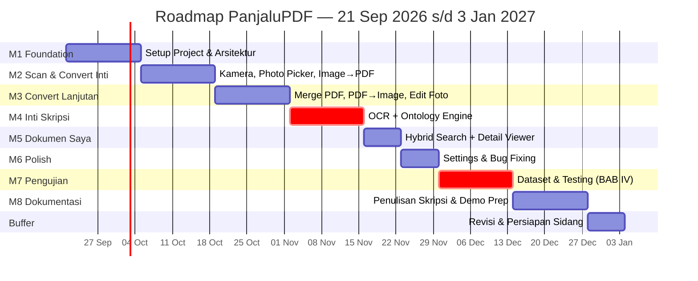

# Roadmap Pengembangan — PanjaluPDF

**Mulai:** Senin, 21 September 2026 **Target selesai development + pengujian:** Minggu, 27 Desember 2026 (+ 1 minggu buffer sampai 3 Januari 2027) **Total durasi:** 14 minggu (~3,5 bulan) **Metodologi:** Sprint mingguan/dwi-mingguan, selaras dengan Implementation Plan Frontend & Backend

> 📝 **Dokumen ini editable.** Tanggal di bawah adalah estimasi PM berdasarkan kompleksitas tiap modul — sesuaikan bebas dengan jadwal bimbingan, deadline sempro, atau kecepatan belajar Anda sendiri. Struktur milestone & urutan kerja disarankan tetap dipertahankan karena tiap tahap bergantung pada tahap sebelumnya.

---

## Timeline Visual (Gantt Chart)

---

## Milestone 1 — Foundation & Setup

**📅 21 Sep – 4 Okt 2026 (2 minggu)**

- [x] Setup Android Studio + integrasi Antigravity IDE (prompt konteks dari Implementation Plan BE & FE ditempel di awal sesi)
- [ ] Inisialisasi Git repository + struktur package sesuai Bagian 3 Implementation Plan Backend
- [ ] Setup Hilt (DI modules dasar)
- [ ] Setup Room Database — schema awal `DocumentEntity`
- [ ] Setup Navigation Compose — shell 4 tab (Convert, Edit Foto, Dokumen Saya, Settings) + FAB kosong
- [ ] Integrasi design token Aeris Authority ke `ColorScheme` & `Typography` Compose
- [ ] Implementasi Splash Screen (3 detik, sesuai spec)
- [ ] Setup font custom (Hanken Grotesk, Inter, JetBrains Mono)

**🎯 Deliverable:** Aplikasi bisa dibuka, navigasi antar tab kosong berfungsi, tema visual sudah sesuai brand.

---

## Milestone 2 — Scan & Convert (Fitur Inti Pertama)

**📅 5 – 18 Okt 2026 (2 minggu)**

- [ ] Integrasi CameraX — live preview
- [ ] Overlay deteksi tepi dokumen real-time (edge detection)
- [ ] Capture → crop otomatis → perspective correction
- [ ] Integrasi Photo Picker (import dari galeri tanpa permission storage)
- [ ] `ScanDocumentUseCase`
- [ ] `ConvertImageToPdfUseCase` (PdfBox-Android)
- [ ] Progress indicator bertahap (WorkManager `setProgressAsync`, 3 tahap)
- [ ] Strategi kompresi gambar sebelum jadi PDF (`Bitmap.compress`)

**🎯 Deliverable:** Fitur "Image to PDF" jalan end-to-end (scan atau import → convert → simpan ke storage lokal).

---

## Milestone 3 — Convert Lanjutan & Edit Foto

**📅 19 Okt – 1 Nov 2026 (2 minggu)**

- [ ] `MergePdfUseCase` — gabung PDF + reorder halaman (drag-and-drop)
- [ ] `ExtractPdfToImageUseCase` — PDF ke gambar
- [ ] Tools Edit Foto: Crop manual (4 titik draggable), Rotate 90°
- [ ] Preset filter: Magic Color, Hitam Putih/Grayscale (klarifikasi beda/sama dulu), Asli
- [ ] Slider Kecerahan & Kontras (state sementara sebelum simpan)

**🎯 Deliverable:** Semua 3 fitur tab Convert selesai, tab Edit Foto lengkap dengan tools dasar.

---

## Milestone 4 — OCR + Ontology Engine ⭐ (Inti Nilai Skripsi)

**📅 2 – 15 Nov 2026 (2 minggu)**

> Prioritas tertinggi — ini yang membedakan PanjaluPDF dari scanner biasa dan jadi fokus utama BAB III & IV.

- [ ] `MlKitTextRecognizer` wrapper (Google ML Kit Text Recognition)
- [ ] Susun `ontology.json` final — 5 kelas: KTP, KK, Invoice, Ijazah, Surat Resmi (+ fallback Dokumen Umum)
- [ ] `OntologyLoader` — baca & cache JSON dari assets
- [ ] `ClassifyDocumentUseCase` — algoritma rule-based keyword matching + scoring
- [ ] Tentukan & uji coba threshold skor minimum (fallback ke "Dokumen Umum")
- [ ] `DocumentProcessingWorker` — orkestrasi OCR → klasifikasi → simpan, jalan di background
- [ ] Unit test awal untuk `ClassifyDocumentUseCase` (pakai teks dummy per kelas)

**🎯 Deliverable:** Dokumen yang di-scan otomatis terklasifikasi dengan skor kecocokan & breakdown kata kunci tersimpan di database.

---

## Milestone 5 — Dokumen Saya & Detail Viewer

**📅 16 – 22 Nov 2026 (1 minggu)**

- [ ] `SearchDocumentUseCase` — hybrid search (query gabungan nama file + metadata)
- [ ] UI tab Dokumen Saya: list dokumen, badge jenis dokumen, filter chip kategori
- [ ] UI layar Detail Dokumen: breakdown kata kunci terverifikasi + bobot kumulatif
- [ ] Empty state (belum ada dokumen)

**🎯 Deliverable:** Fitur pencarian cerdas selesai — nilai jual utama aplikasi siap didemokan.

---

## Milestone 6 — Settings & Polish

**📅 23 – 29 Nov 2026 (1 minggu)**

- [ ] Settings screen: toggle preferences via DataStore (bukan Room)
- [ ] Opsi kualitas kompresi PDF (Tinggi/Sedang/Standar)
- [ ] Error handling & validasi (permission ditolak, storage penuh, dll)
- [ ] Bug fixing pass menyeluruh dari Milestone 1-5
- [ ] Keputusan final: Dark Mode & Random Color Palette dikerjakan atau ditunda ke saran BAB V

**🎯 Deliverable:** Aplikasi stabil, siap masuk fase pengujian formal.

---

## Milestone 7 — Dataset & Pengujian (untuk BAB IV)

**📅 30 Nov – 13 Des 2026 (2 minggu)**

- [ ] Generate dataset dummy final — 20-30 dokumen per kelas (100-150 total) via script Python
- [ ] Print + foto subset dataset (±25 dokumen) untuk uji kondisi nyata (kamera, pencahayaan)
- [ ] Unit test lengkap (JUnit + MockK) untuk seluruh UseCase
- [ ] Hitung metrik: precision, recall, F1-score per kelas dokumen
- [ ] Dokumentasikan kasus gagal klasifikasi (transparansi, bukan cuma yang berhasil)
- [ ] UAT manual end-to-end (skenario penggunaan nyata)

**🎯 Deliverable:** Data hasil pengujian lengkap & terdokumentasi, siap ditulis ke BAB IV.

---

## Milestone 8 — Dokumentasi Skripsi & Persiapan Demo

**📅 14 – 27 Des 2026 (2 minggu)**

- [ ] Tulis BAB IV (implementasi & hasil pengujian) berdasarkan data Milestone 7
- [ ] Rekam video demo cadangan (kondisi ideal, sudah diuji lancar)
- [ ] Review & finalisasi seluruh BAB (I-V)
- [ ] Siapkan slide presentasi sidang
- [ ] Update dokumen "Simulasi Tanya Jawab" jika ada perubahan arsitektur

**🎯 Deliverable:** Naskah skripsi lengkap + materi presentasi siap sidang.

---

## Buffer — Revisi & Persiapan Akhir

**📅 28 Des 2026 – 3 Jan 2027 (1 minggu)**

- [ ] Waktu cadangan untuk hal tak terduga dari milestone sebelumnya
- [ ] Revisi berdasarkan masukan Pak Roni (bimbingan terakhir)
- [ ] Gladi bersih presentasi

---

## Catatan untuk Penggunaan Roadmap Ini

- **Prioritas kalau waktu mepet:** Milestone 4 (Ontology Engine) dan Milestone 7 (Pengujian) **tidak boleh dipotong** — itu inti nilai akademis skripsi. Kalau harus memangkas, potong dulu dari Milestone 3 (fitur convert lanjutan) atau Milestone 6 (polish/dark mode).
- **Tempel bagian milestone yang relevan** ke Antigravity IDE di awal tiap sesi kerja, supaya agent fokus ke scope minggu itu saja, bukan mengerjakan semua sekaligus.
- **Checklist task** di tiap milestone bisa langsung dicentang manual di file ini (`- [ ]` → `- [x]`) sebagai tracker progress sederhana.